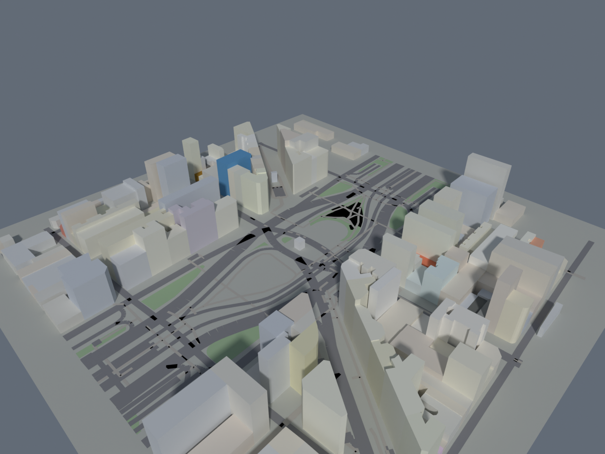
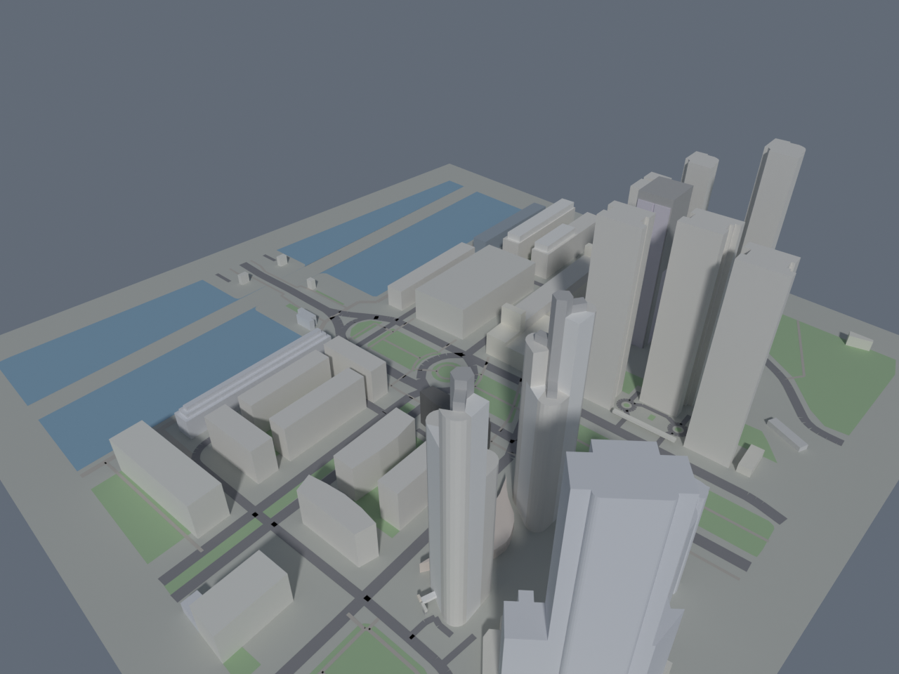
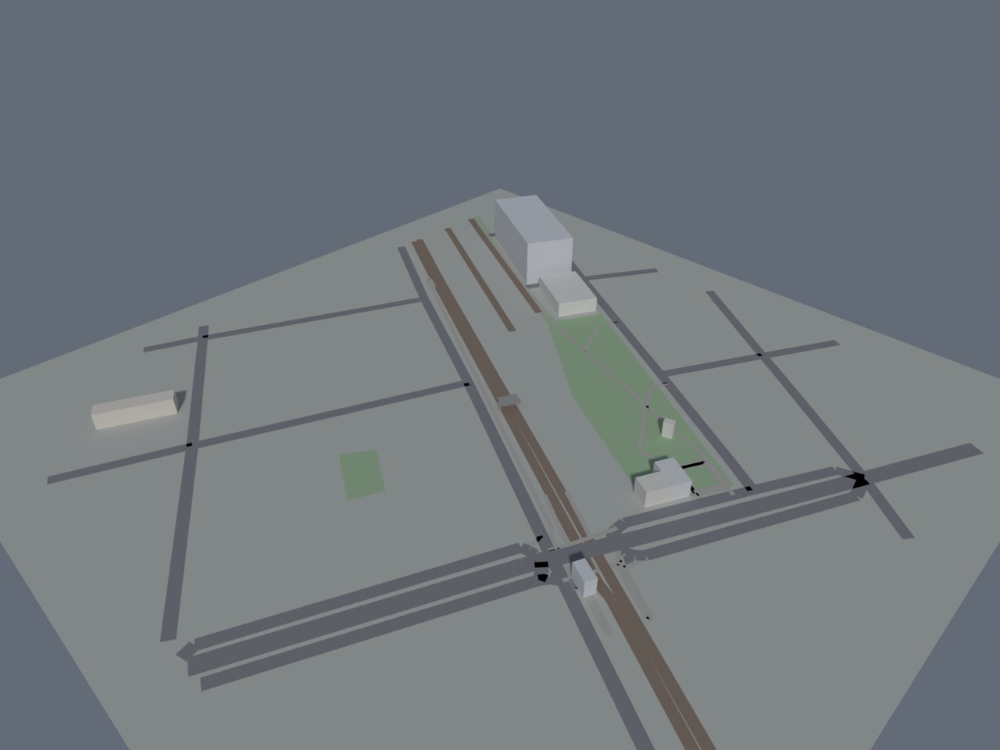

# maps-to-3d 🗺️→🏙️

Skill de Claude Code que convierte **un lugar de Google Maps en un modelo 3D
con colores en Blender**, y lo renderiza para que Claude pueda "verlo".

Le pasás un link de Google Maps (o unas coordenadas, o el nombre de un lugar) y
te devuelve:

| Archivo | Que es |
|---|---|
| `render.png` | Render 3D de la zona con colores (vista 3/4 aérea) |
| `model.blend` | El modelo 3D **editable en Blender** |
| `scene.json` | La geometría intermedia (en metros) |
| `streetview/`, `photos/` | Imágenes reales de Google (si configurás API key) |


*Zona del Obelisco (Av. 9 de Julio), Buenos Aires — `--radius 200`.*


*Puerto Madero, Buenos Aires — `--radius 250`. Se ven los diques (agua en azul) y las torres altas con su altura real.*


*Cruce del FC Mitre en Federico Lacroze — `--radius 180`. Las vías del tren (marrón) y la pasarela peatonal elevada sobre ellas con sus pilares.*

## Cómo funciona

```
lugar de Google Maps
   │
   ├─▶ 1. Resuelve link/coords/nombre → lat,lng
   │       (sigue links cortos maps.app.goo.gl, o geocodifica con Google)
   │
   ├─▶ 2. OpenStreetMap (Overpass API, gratis, sin key)
   │       edificios + alturas, calles, vías de tren, agua, parques
   │       (los puentes `bridge=yes` se elevan con pilares)
   │
   ├─▶ 3. (opcional) Google Street View + fotos del lugar  ← necesita API key
   │
   ├─▶ 4. Proyecta a metros y recorta al radio pedido → scene.json
   │
   └─▶ 5. Blender (bpy): extruye edificios con color, dibuja calles/agua/verde,
           pone cámara + sol, y renderiza → render.png + model.blend
```

La geometría 3D sale de **OpenStreetMap** (no necesita API key). Las imágenes
reales de Google (Street View / fotos) son opcionales y necesitan una key de
Google Maps Platform.

## Instalación

```bash
# 1. Dependencia de Python
python3 -m pip install requests

# 2. Blender — cualquiera de las dos:
#    (a) tener el binario 'blender' en el PATH, o
#    (b) instalarlo como módulo de Python (requiere Python 3.11):
python3 -m pip install bpy

# 3. (opcional) API key de Google para Street View / fotos / búsqueda por nombre
export GOOGLE_MAPS_API_KEY="tu_key"
```

Para usarla como skill de Claude Code, poné esta carpeta en tu directorio de
skills, por ejemplo:

```bash
ln -s "$(pwd)" ~/.claude/skills/maps-to-3d
```

## Uso directo (sin Claude)

```bash
# Por coordenadas (¡entre comillas por el signo menos!)
python3 scripts/place_to_3d.py "-34.6037,-58.3816" --radius 200

# Por link de Google Maps
python3 scripts/place_to_3d.py "https://maps.app.goo.gl/xxxxx" --radius 300

# Por nombre (necesita GOOGLE_MAPS_API_KEY)
python3 scripts/place_to_3d.py "Times Square, New York" --radius 250

# Si tenés el binario de Blender en vez del módulo bpy:
python3 scripts/place_to_3d.py "-34.60,-58.38" --blender /usr/bin/blender
```

### Opciones

| Opción | Default | Descripción |
|---|---|---|
| `--radius M` | 250 | Radio de la zona en metros. Detalle: 120-200. Barrio: 300-500. |
| `--out DIR` | `output/<slug>` | Carpeta de salida |
| `--no-streetview` | — | No bajar imágenes de Google |
| `--no-render` | — | Solo bajar datos (genera `scene.json`, no abre Blender) |
| `--blender PATH` | `$BLENDER_BIN` | Ruta al binario de Blender |

## Ajustar el look

- **Colores de edificios:** `BUILDING_COLORS` y `VARIED_NEUTRALS` en
  `scripts/place_to_3d.py`.
- **Luz / exposición / cámara:** las constantes al principio de
  `scripts/blender_build.py` (`SUN_ENERGY`, `EXPOSURE`, `CAM_ELEV_DEG`,
  `CAM_AZIM_DEG`, `CAM_DIST_FACTOR`, `CYCLES_SAMPLES`, `RES_X/RES_Y`).

## Limitaciones

- Las alturas de los edificios salen de los tags de OSM (`height` /
  `building:levels`); si faltan, se estiman por tipo. Es una **maqueta creíble**,
  no un levantamiento exacto.
- Overpass (OSM) es gratis y a veces se satura → puede requerir reintentar.
- No reconstruye fachadas con textura foto-realista; hace un modelo de volúmenes
  con colores (estilo maqueta/mapa 3D). Las fotos de Street View se bajan aparte
  como referencia.

## Estructura

```
maps-to-3d/
├── SKILL.md                 # definición de la skill (para Claude)
├── README.md
├── requirements.txt
├── scripts/
│   ├── place_to_3d.py       # orquestador: link→coords, OSM, Street View, scene.json
│   └── blender_build.py     # Blender (bpy): construye el 3D con colores y renderiza
└── docs/
    └── example-obelisco.png # render de ejemplo
```
