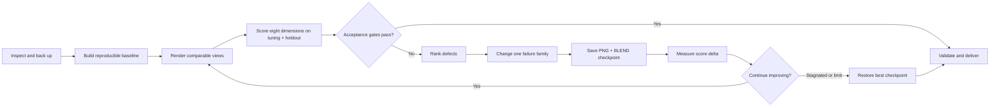

# geoblender: real places to Blender scenes

Give it a Google Maps link, coordinates, or a place name and it constructs an
editable block-based 3D scene in Blender. The main contribution is the agent loop:

`place -> scene -> render -> compare with reality -> correct -> repeat`

## OpenAI Build Week: built with Codex and GPT-5.6

GeoBlender was created during the July 13-21, 2026 OpenAI Build Week
submission period. It builds on the pre-existing open-source
[ahujasid/blender-mcp](https://github.com/ahujasid/blender-mcp) connection layer,
while the repository-authored geographic pipeline, skills, safe Blender
orchestration, checkpoints, evaluation policy, and block construction system are
new Build Week work. The dated [commit history](https://github.com/MartinPuli/geoblender/commits/main) documents
that development window.

### How I collaborated with Codex

- I used Codex with GPT-5.6 Sol as the implementation agent: it researched the
  relevant OSM and Blender conventions, inspected the repository, wrote the
  Python pipeline and skill instructions, and operated Blender through MCP.
- Codex accelerated the repetitive engineering work: normalizing geographic
  data, generating Blender payloads, adding safe-clear and checkpoint behavior,
  creating tuning and held-out cameras, writing tests, and tracing failures in
  dense Overpass queries.
- We worked through a render-evaluate-correct loop rather than accepting the
  first image. Codex rendered comparable views, ranked visible defects, changed
  one failure family at a time, validated the artifacts, and restored the best
  checkpoint when a later iteration regressed.
- I made the key product and design decisions: real editable blocks instead of
  pasted Google 3D Tiles, source provenance over hidden guesses, multi-view
  anti-overfit evaluation, the open-source boundary, and the current football
  stadium ticketing direction. I reviewed outputs and decided which iterations
  were accepted or rejected.

### Judge-ready demo and test path

- [Two-minute public demo](https://youtu.be/SiVsczk-1vw)
- [Prebuilt editable New York `.blend`](output/nyc_one_prompt_showcase/nyc_one_prompt_showcase_final.blend)
- Install and run the no-rebuild checks with
  `python3 -m pip install -e .` followed by `python3 -m pytest tests/ -q`.
- Generate normalized data without Blender or an API key with
  `place2blender "New York, NY" --radius 350 --no-render`.

The required Codex `/feedback` Session ID is supplied separately in the Devpost
submission form; it is not committed to this public repository.

## Upstream attribution

The live Blender control layer is built on
[**ahujasid/blender-mcp**](https://github.com/ahujasid/blender-mcp), created by
**Siddharth Ahuja** and released under the **MIT License**.

We did **not** create the Blender MCP addon, MCP server, transport, or its native
tools. This repository contributes the `geoblender` and `blender-mcp-loop`
skills, the geographic data/modeling pipeline, safe live-Blender orchestration,
checkpointing, and the visual evaluation loop that run on top of that upstream
project. The upstream addon/server is not vendored here.

## Construction output

| Mode | Geometry | Best for | Output |
|---|---|---|---|
| **Blocks — required default** | Constructed from normalized OSM footprints, paths, areas, heights, and semantic features | The skill's editable, measurable, redistributable deliverable | `.blend`, renders, `build_report.json`, `eval_report.json` |
| **Detailed procedural OSM — explicit opt-in** | OpenStreetMap volume extrusion plus procedural/PBR materials | A secondary higher-detail pass after the block model exists | `.blend`, GLB, `report.json` |

The skill never substitutes Google Photorealistic 3D Tiles, screenshots, image
planes, or projected provider imagery for constructed geometry. Google imagery
may be viewed beside the render as evaluation evidence, but it is not pasted
into Blender and is not the deliverable.

Building form follows OSM Simple 3D Buildings: `building:part` volumes replace
their containing 2D outline, retain independent height/material/roof tags, and
support `min_height` / `building:min_level`. Near the focus, a bounded inferred
construction LOD adds plinths, floor strings, cornices, entrances, and editable
window panels. These details are reported as inferred and never presented as
surveyed architecture.

## Compliance

- **Google 3D Tiles are outside the normal skill workflow.** The repository keeps
  experimental render-only utilities, but the block constructor never calls them.
- **OSM-derived output is redistributable under ODbL** with
  `© OpenStreetMap contributors` attribution.
- **PolyHaven textures and HDRIs are CC0.**
- **Blender MCP is MIT-licensed upstream software.** Credit
  [ahujasid/blender-mcp](https://github.com/ahujasid/blender-mcp) and retain its
  license when redistributing substantial portions of that software.

See [External Sources & Licenses](docs/SOURCES_LICENSES.md) for the complete
source and license inventory.

## Quickstart

```bash
python3 -m pip install requests
export GOOGLE_MAPS_API_KEY="your_key"          # optional references only

# Normalize construction data
python3 scripts/place_to_3d.py "<place>" --radius 350 --no-render --out output/<place>

# Construct and evaluate the editable block model
blender -b -P scripts/blocks_build.py -- output/<place>/scene.json output/<place> <place> --render
blender -b output/<place>/<place>_blocks.blend -P scripts/blocks_eval.py -- output/<place>
```

For a live Blender session, install and connect the upstream
[Blender MCP](https://github.com/ahujasid/blender-mcp), then use the
`blender-mcp-loop` skill. `scripts/mcp_loop.py` creates a reproducible block baseline;
`scripts/loop_engineering.py` records scores, defects, changes, deltas, and the
best checkpoint until the acceptance gates pass or the best result is restored.

Blender 5.x is recommended. The smoke test is run against the installed
`/Applications/Blender.app` binary when available.

## Package installation

```bash
python3 -m pip install -e .
place2blender "<place>" --radius 350 --no-render
python3 -m pytest tests/ -q
```

Environment configuration: `MAPS3D_RADIUS`, `MAPS3D_SAMPLES`,
`MAPS3D_ENGINE`, `MAPS3D_TEXTURES`, `MAPS3D_HDRI`, `GEOBLENDER_CACHE`, and
`MAPS3D_LOGLEVEL`. OSM responses are cached to avoid repeated Overpass queries.
When a dense bbox overloads Overpass, acquisition automatically retries four
deduplicated quadrants and then the official OSM map API with recursive node-limit
subdivision. `MAPS3D_OVERPASS_SHARDS=1` and `MAPS3D_OSM_MAP_API=1` force either
fallback for reproducible troubleshooting.

## The engineering loop

This project does not treat generation as a blind one-shot prompt. It runs a
small, explicit optimization loop around a live Blender session. Blender MCP
executes and renders the scene; the repository-owned engineering layer records
evidence, decides what to change, and preserves the best result.

Two pure Python modules divide the responsibilities:

| Module | Responsibility |
|---|---|
| `scripts/mcp_loop.py` | Generates safe Python payloads for the live Blender: inspect, back up, build, render, checkpoint, validate, save, and restore. It does not import `bpy`, so payload generation is testable outside Blender. |
| `scripts/loop_engineering.py` | Owns the reproducible loop state: scores, ranked defects, controlled changes, deltas, stagnation, acceptance, and the best checkpoint. It has no Blender dependency. |



### Reproducible baseline

`one_shot_payload(...)` first saves the existing live scene, performs a safe
object-level clear, invokes `blocks_build.build_from_scene` on `scene.json`,
creates comparable aerial, oblique, and different-azimuth holdout renders, saves the editable block `.blend`,
and validates the required artifacts. Its
`BASELINE_READY` result is iteration zero—not the end of the engineering loop.
“One shot” means the user does not have to micromanage internal tool calls.

The live path never calls `bpy.ops.wm.read_factory_settings()`: a factory reset
unregisters the upstream Blender MCP addon and kills the active connection.
It also never calls the Google 3D Tiles fetcher or importer.

### Measured scoring

Each render/reference pair receives eight scores from 0 to 100. The weighted
score keeps construction and building identity ahead of surface polish:

| Dimension | Weight | What it measures |
|---|---:|---|
| Semantics | 18% | Correct feature identity, infrastructure type, and scene meaning |
| Geometry | 18% | Footprints, height, scale, density, and spatial relationships |
| Silhouette | 14% | Skyline, roofline, massing, and landmark outline |
| Facade structure | 14% | Floor rhythm, bay rhythm, openings, and LOD artifacts |
| Color | 12% | Facade and roof palette inside matched building masks |
| Framing | 10% | Camera position, bearing, FOV, crop, and comparable composition |
| Materials | 8% | Plausible roughness, glass, masonry, metal, asphalt, and water |
| Lighting | 6% | Exposure, sun direction, contrast, sky, and shadow behavior |

Default acceptance requires tuning and held-out weighted scores of at least
**85**, every dimension on both sets at least **70**, a generalization gap no
greater than **8**, and **zero critical defects**. Checkpoints are ranked by the
worse of tuning and holdout, so a single flattering camera cannot win.

### Controlled corrections

Iteration zero is the baseline. Every later iteration must declare exactly one
change family—for example camera, geometry, materials, or lighting—plus the
expected effect. The loop then records the new score and delta. This makes an
improvement attributable and prevents prompt thrashing where several unrelated
changes make regressions impossible to diagnose.

Non-camera changes must keep the camera signature frozen. Each iteration persists:

- `loop_NN.png`: the comparable tuning evidence.
- `loop_NN_holdout.png`: the frozen view that was not used to choose the fix.
- `loop_NN.blend`: the exact Blender checkpoint that produced it.
- `loop_state.json`: policy, scores, defects, deltas, changes, artifacts, and the
  current `best_iteration`.

State writes are atomic, so a Blender or MCP failure cannot leave a half-written
loop record.

### Stop, rollback, and deliver

The default policy accepts only when tuning and holdout pass, stops after six
iterations, or detects stagnation after two consecutive improvements below one
point. Stopping does not mean delivering the latest attempt: the system restores
the highest-scoring checkpoint, validates the camera, scene content, `.blend`,
and renders, then produces the final report.

See [the full evaluation protocol](EVALUATION.md) and
[the live Blender MCP loop](docs/MCP_LOOP.md) for the operational details.

## What is implemented

- Per-building identity, provenance, confidence, and height source.
- OSM `roof:shape` support with deterministic fallbacks.
- OSM `building:part`, `min_height`, roof height/levels, orientation, and
  direction support for stepped, source-driven massing.
- Urban profiles inferred from OSM statistics rather than city names.
- Tag-driven landmarks and special infrastructure without preinstalled locations.
- Collision-safe street cameras.
- Airport layers that preserve runways, taxiways, aprons, and helipads.
- Optional OSM2World adapter; the native procedural generator remains the default.
- Safe Blender MCP loop with backups, controlled changes, validation, and restore.
- Generic block-model renderer as the required construction path, with per-run
  declarative evaluation gates.
- Source-aware facade/roof colors: explicit OSM values outrank material and
  semantic priors; aerial samples populate roof color without repainting walls.
- Tag-driven facade grammar with face-aligned shader windows and bounded
  near-field editable window geometry.
- Bounded construction-detail grammar with plinths, floor strings, cornices,
  and one grounded entrance anchor; all procedural layers retain inferred
  provenance and disappear outside the configured LOD radius.
- Frozen held-out camera, generalization-gap gate, and holdout-ranked rollback.

## Project boundary

| Layer | Origin |
|---|---|
| Blender addon, MCP server, connection protocol, native Blender MCP tools | [ahujasid/blender-mcp](https://github.com/ahujasid/blender-mcp) |
| Place resolution, OSM normalization, block construction, optional procedural OSM rendering | This repository |
| `geoblender` and `blender-mcp-loop` skill instructions | This repository |
| Safe-clear wrappers, checkpoints, scoring, restore logic, block QA | This repository |

## Roadmap

- A stricter source -> normalized `CityScene` -> renderer boundary.
- Optional mask-based CIEDE2000/SSIM diagnostics for pose-matched references.

## License

Repository-authored code is [MIT licensed](LICENSE). External components and data
retain their own licenses and terms; see
[docs/SOURCES_LICENSES.md](docs/SOURCES_LICENSES.md).
